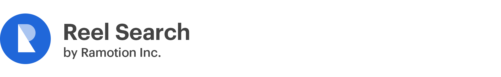

[](https://ramotion.com?utm_source=gthb&utm_medium=special&utm_campaign=reel-search-logo)

<br><br/>
# RAMReel
[](https://developer.apple.com/swift/)
[](https://cocoapods.org/pods/RAMReel)
[](http://cocoapods.org/pods/RAMReel)
[](https://github.com/Ramotion/reel-search)
[](https://codebeat.co/projects/github-com-ramotion-reel-search)
[](https://travis-ci.org/Ramotion/reel-search)
[](http://twitter.com/Ramotion)
[](https://paypal.me/Ramotion)

## About
This project is maintained by Ramotion, Inc.<br>
We specialize in the designing and coding of custom UI for Mobile Apps and Websites.<br>

**Looking for developers for your project?**<br>
This project is maintained by Ramotion, Inc. We specialize in the designing and coding of custom UI for Mobile Apps and Websites.

<a href="mailto:alex.a@ramotion.com?subject=Project%20inquiry%20from%20Github">
</a> <br>


The [iPhone mockup](https://store.ramotion.com/product/iphone-x-clay-mockups?utm_source=gthb&utm_medium=special&utm_campaign=reel-search) available [here](https://store.ramotion.com?utm_source=gthb&utm_medium=special&utm_campaign=reel-search).

## Requirements

- iOS 8.0+
- Swift 4.0

## Installation

We recommend using **[CocoaPods](https://cocoapods.org/)** to install our library.

Just put this in your `Podfile`:

~~~ruby
pod 'RAMReel'
~~~

or [Carthage](https://github.com/Carthage/Carthage) users can simply add `reel-search` to their `Cartfile`:
```
github "Ramotion/reel-search"
```

## Usage

In order to use our control you need to implement the following:

### Types
- **`CellClass`**: Your cell class must inherit from [`UICollectionViewCell`](https://developer.apple.com/library/ios/documentation/UIKit/Reference/UICollectionViewCell_class/) and implement the [`ConfigurableCell`](https://rawgit.com/Ramotion/reel-search/master/docs/Protocols/ConfigurableCell.html) protocol. Or you can just use our predefined class [`RAMCell`](https://rawgit.com/Ramotion/reel-search/master/docs/Classes/RAMCell.html).
- **`TextFieldClass`**: Any subclass of [`UITextField`](https://developer.apple.com/library/ios/documentation/UIKit/Reference/UITextField_Class/) will do.
- **`DataSource`**: Your type must implement the [`FlowDataSource`](https://rawgit.com/Ramotion/reel-search/master/docs/Protocols/FlowDataSource.html) protocol, with `QueryType` being `String` and `ResultType` being [`Renderable`](https://rawgit.com/Ramotion/reel-search/master/docs/Protocols/Renderable.html) and [`Parsable`](https://rawgit.com/Ramotion/reel-search/master/docs/Protocols/Parsable.html). Or you can just use our predefined class [`SimplePrefixQueryDataSource`](https://rawgit.com/Ramotion/reel-search/master/docs/Structs/SimplePrefixQueryDataSource.html), which has its `ResultType` set to `String`.

Now you can use those types as generic parameters of type declaration of `RAMReel`:

~~~swift
RAMReel<CellClass, TextFieldClass, DataSource>
~~~

### Values
Next you need to create an instance of `RAMReel`, and for that you need the following:

- **`frame: CGRect`**: Rect, specifying where you want to put the control.
- **`dataSource: DataSource`**: the source of data for the reel.
- **`placeholder: String`** (*optional*): Placeholder text; by default, an empty string is used.
- **`hook: DataSource.ResultType -> Void`** (*optional*): Action to perform on element selection, `nil` by default. You can add additional hooks later, if you need multiple actions performed.

Let's use it to create an instance of `RAMReel`:

~~~swift
let ramReel = RAMReel<CellClass, TextFieldClass, DataSource>(frame: frame, dataSource: dataSource, placeholder: placeholder, hook: hook)
~~~

### Adding action hooks

To add extra actions you may append `DataSource.ResultType -> Void` functions to `RAMReel` object property `hooks`:

~~~swift
ramReel.hooks.append { data in
	// your code goes here
}
~~~

### Putting on the view

And the final step, showing `RAMReel` on your view:

~~~swift
ramReel.view.autoresizingMask = [.FlexibleWidth, .FlexibleHeight]
yourView.addSubview(ramReel.view)
~~~

If you have visual problems, try calling  [`prepareForViewing`](https://rawgit.com/Ramotion/reel-search/master/docs/Classes/RAMReel.html#/s:FC7RAMReel7RAMReel17prepareForViewingu1_Rdq_CSo20UICollectionViewCellq_S_16ConfigurableCelldq0_CSo11UITextFieldq1_S_14FlowDataSourceqq_S2_8DataTypeS_8Parsableqq_S2_8DataTypeS_10Renderablezqq_S2_8DataTypeqq1_S4_10ResultTypezqq1_S4_9QueryTypeSS_FGS0_q_q0_q1__FT_T_) before showing your view.

Like this:

~~~swift
override func viewDidLayoutSubviews() {
	super.viewDidLayoutSubviews()
	ramReel.prepareForViewing()
}
~~~

### Theming

If you want to change `RAMReel` look and feel, you can use theming.

To do so, you just to have to implement the [`Theme`](https://rawgit.com/Ramotion/reel-search/master/docs/Protocols/Theme.html) protocol in your class/structure and set your `RAMReel` object's `theme` property to your theme.

Or you can just use the predefined instance of type [`RAMTheme`](https://rawgit.com/Ramotion/reel-search/master/docs/Structs/RAMTheme.html).

~~~swift
let textColor: UIColor
let listBackgroundColor: UIColor
let font: UIFont

let theme = RAMTheme(textColor: textColor, listBackgroundColor: listBackgroundColor, font: font)
~~~

### Docs

[](https://rawgit.com/Ramotion/reel-search/master/docs/index.html)

See more at [RAMReel docs](https://rawgit.com/Ramotion/reel-search/master/docs/index.html)

<br>


This library is a part of a <a href="https://github.com/Ramotion/swift-ui-animation-components-and-libraries"><b>selection of our best UI open-source projects.</b></a>

# Get the Showroom App for iOS to give it a try
Try this UI component and more like this in our iOS app. Contact us if interested.

<a href="https://itunes.apple.com/app/apple-store/id1182360240?pt=550053&ct=reel-search&mt=8" >
</a>
<a href="mailto:alex.a@ramotion.com?subject=Project%20inquiry%20from%20Github">
</a>
<br>
<br>

Follow us for the latest updates<br>
<a href="https://goo.gl/rPFpid" >
</a>
